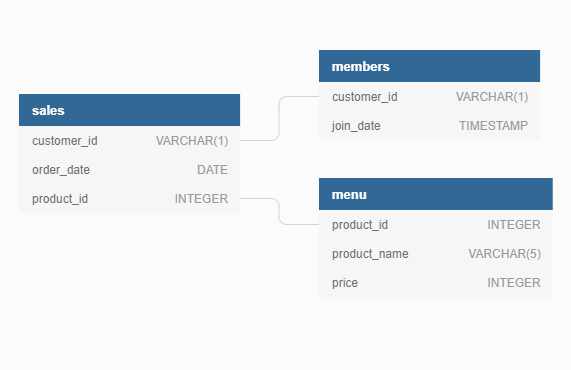

# Data Exploration

In this section the data of each table from the ERD was explored.



There are 3 tables in the ERD:

- ``members``
- ``sales``
- ``menu``

## Table #1 - members 

The output was limited to only 5 rows to get a preview of the ``members`` table.

```sql
SELECT * 
FROM dannys_diner.members 
LIMIT 5;
```
| customer_id | join_date  |
|-------------|------------|
| A           | 2021-01-07 |
| B           | 2021-01-09 |

This table contains the ``customer_id`` that joined the beta loyalty rewards program of the restaurant.

There is a unique sequential ``customer_id`` for each record in the table. There is also information about the date when the customer joined the loyalty program.

In the ERD there is a linkage between this ``members`` table with the ``sales`` table via the ``customer_id`` field.

There was no need to see how many records the ``members`` table had since the previous output  only returned 2 records.

## Table#2 - sales

The output was limited to only 5 rows to get a preview of the ``sales`` table.

| customer_id | order_date | product_id |
|-------------|------------|------------|
| A           | 2021-01-01 | 1          |
| A           | 2021-01-01 | 2          |
| A           | 2021-01-07 | 2          |
| A           | 2021-01-10 | 3          |
| A           | 2021-01-11 | 3          |

This table contains the ``product_id`` that every ``customer_id``purchased with a corresponding ``order_date``.

The ``sales`` table is linked to the previous ``members`` table via the ``customer_id`` and also has a linkage with the ``menu`` table via the ``product_id`` field.

A ``COUNT`` was used to do a row count of the ``sales`` table.

```sql
SELECT 
  COUNT(*) AS count_sales
FROM dannys_diner.sales;
```

| count_sales |
|-------|
| 15    |

There were a total of 15 sales in the ``sales`` table.

## Table#3 - menu

The output was limited to only 5 rows to get a preview of the ``menu`` table.

```sql
SELECT *
FROM dannys_diner.menu
LIMIT 5;
```
| product_id | product_name | price |
|------------|--------------|-------|
| 1          | sushi        | 10    |
| 2          | curry        | 15    |
| 3          | ramen        | 12    |

This table contains all the dishes with their prices, that are sold in the diner. 

The ``menu`` table is linked to the previous ``sales`` table via the ``product_id``.

There was no need to see how many products the ``menu`` table had since the previous output  only returned 3 products.

## Problem Approach

The next section showed the possible output for the questions to have better focus before fully solving the questions.

Please make sure to click on the link below to go to the next section.

[](https://github.com/)